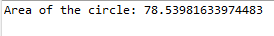

# Problem Statement:

10.	Demonstrate the implementation of an interface concept with a simple program 

## Algorithm:

1.	Create a Java file and define the interface named “Shape” with a method to calculate the area named calculateArea
2.	Create a class named “Circle” that implements the Shape interface using “implements” keyword 
3.	Define the method calculateArea() with the necessary formula
4.	In another class, use the interface and the implementing class to obtain the result

## Sample Output:

