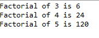

## Problem Statement

Find the factorial of a number using recursion
## Algorithm

1.	Define the class "Factorial"  with the recursive method "fact" within the class
2.	In the method, Declare an integer parameter "n” and an integer variable “result”
3.	Check if "n" is equal to 1
		3.1 If true, return 1 as the base case of the recursion
4. If "n" is not equal to 1, perform the following steps:
      4.1 Call the "fact" method recursively with the argument "n-1" and assign the result to "result”
      4.2 Multiply "result" with "n" and assign the product back to "result"
5. Return the value of "result"
6. Define the class "Recursion" with the main method
7. Create an instance of the "Factorial" class named "f and call the method with different n
          values
8. Print the resultant value

## Sample Output:

