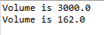

## Problem Statement:

Java program that invoke the Box class created with a method named “volume” from 2 Box objects

## Algorithm:
1.	Define the class "Box" and declare the instance variables "width", "height", and "depth" as doubles within the class
2.	Display the result of multiplying "width", "height", and "depth" using System.out.println() in the method
3.	Define the class "BoxDemo" and declare the main method within the  class. 
4.	Create two instances of the "Box" class named "mybox1" and "mybox2". 
5.	Assign the values 10, 20, and 15 to the instance variables "width", "height", and "depth" of "mybox1" respectively
6.	Assign the values 3, 6, and 9 to the instance variables "width", "height", and "depth" of "mybox2" respectively. 
7.	Call the "volume" method on "mybox1"  and “mybox2” to display the volume of the first and second box 

## Sample Output:

