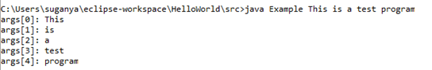

# Problem Statement:

6.	Write a program to demonstrate how the command-line arguments are accessed inside a Java program 

## Algorithm:

1.	Define a class named “Example” 
2.	Inside the class, define the main method to accept command line arguments
3.	The args parameter is an array of strings that holds the command-line arguments passed to the program
4.	Display the command-line arguments using the args array with for loop, just like any other array

## Sample Output:

