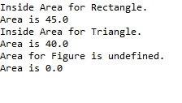

# Problem Statement:

8.	Create a program with a superclass called Figure that defines a method called area( ) which computes the area of an object. Then derives two subclasses from Figure. The first is Rectangle and the second is Triangle. Each of these subclasses overrides area( ) so that it returns the area of a rectangle and a triangle, respectively

## Algorithm:

1.	Define a superclass called Figure
2.	Inside the Figure class, declare a method named area() that returns zero value and does not take any parameters. 
3.	Create a subclass called Rectangle that extends the Figure class
4.	Inside the Rectangle class, override the area() method inherited from the Figure class. Implement the logic to calculate the area of a rectangle using the appropriate formula
5.	Create another subclass called Triangle that also extends the Figure class
6.	Inside the Triangle class, override the area() method inherited from the Figure class. Implement the logic to calculate the area of a triangle using the appropriate formula
7.	Create a class FindAreas with main method to invoke area() method which overridden in the subclasses Rectangle and Triangle to calculate the respective areas

## Sample Output:

