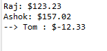

# Problem Statement:

9.	Define a package named “MyPack” with the public class “Balance”. Import that package to make use of the Balance class

## Algorithm:
1.	Create the package directory structure
2.	Create a directory named "MyPack" in  project's source folder
3.	Inside the "MyPack" directory, create a Java file named "Balance.java”
4.	Define the public class named "Balance" with the desired instance variables and a method named show()
5.	Import and use the Balance class in another Java file and use the Balance class, import the package and use the class accordingly. 

## Sample Output:

